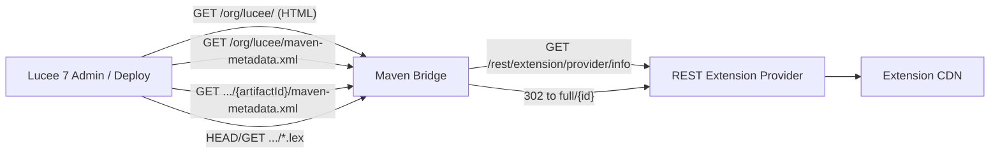

# Extension Provider Maven Bridge

A small Lucee Docker app that exposes a **Maven repository layout** backed by a legacy Lucee **REST extension provider** (`extension.lucee.org`, ForgeBox, or your own update server).

Use it while migrating Lucee 6-style extension providers to the Lucee 7+ Maven GroupId model.

## Why

Lucee 7 discovers extensions by:

1. Listing artifacts under a GroupId (HTML scrape, or group-level `maven-metadata.xml` on newer Lucee)
2. Reading `{artifactId}/maven-metadata.xml` for available versions
3. Downloading `{artifactId}-{version}.lex` from the repository

This bridge translates the REST provider API into that Maven layout.

## Quick start

```sh
cd apps/maven-bridge
docker compose up -d --build
```

Repository base URL: `http://localhost:8856/`

Health check: `http://localhost:8856/health.cfm`

Flush cache and resync from provider: `http://localhost:8856/health.cfm?flush=true`

Group index (HTML): `http://localhost:8856/org/lucee/`

Group metadata (XML): `http://localhost:8856/org/lucee/maven-metadata.xml`

Example artifact metadata: `http://localhost:8856/org/lucee/redis-extension/maven-metadata.xml`

> On startup the bridge syncs Maven metadata files under `{webroot}/{groupId path}/`. Dynamic paths (`.lex` redirects) are handled via `Application.cfc` → `onMissingTemplate`.

## Configure Lucee 7 to use the bridge

Point release repositories at the bridge (server or web context):

```json
{
  "extensionProviders": ["org.lucee"],
  "maven": {
    "repository": ["http://localhost:8856/"]
  }
}
```

Environment variables:

```
LUCEE_EXTENSIONPROVIDERS=org.lucee
LUCEE_MVN_REPO_RELEASES=http://localhost:8856/
```

Or in Docker for a Lucee container on the same compose network:

```
LUCEE_MVN_REPO_RELEASES=http://maven-bridge:8888/
LUCEE_EXTENSIONPROVIDERS=org.lucee
```

## Bridge environment

| Variable | Default | Description |
|----------|---------|-------------|
| `EXTENSION_PROVIDER` | `https://extension.lucee.org` | REST extension provider base URL |
| `GROUP_ID` | `org.lucee` | Maven groupId served by this bridge |
| `CACHE_TTL_MINUTES` | `60` | How long to cache the provider index before automatic refresh |
| `TIMEOUT` | `300` | HTTP timeout (seconds) for provider requests and request timeout |
| `LUCEE_ADMIN_PASSWORD` | — | Lucee administrator password |

## Examples

Bridge ForgeBox instead of extension.lucee.org:

```yaml
environment:
  EXTENSION_PROVIDER: "https://www.forgebox.io"
  GROUP_ID: "org.lucee"
```

Bridge a local update server:

```yaml
environment:
  EXTENSION_PROVIDER: "http://update:8888"
  GROUP_ID: "org.lucee"
```

## Architecture

```
www/
  Application.cfc                         → config, sync repo files, route /org/*
  index.cfm                               → root info
  org/lucee/                              → generated Maven tree (gitignored)
  components/org/lucee/mavenbridge/
    BridgeSupport.cfc                     → fetch REST index, sync + build responses
    proxy/BridgeProxy.cfc                 → HTTP dispatch for dynamic paths (.lex)
```

Data flow:



## Group-level `maven-metadata.xml`

The bridge serves `{groupId path}/maven-metadata.xml` as a Lucee-specific artifact index (not standard Maven plugin metadata, but the same filename and layout convention):

```xml
<metadata>
  <groupId>org.lucee</groupId>
  <artifacts>
    <artifact>
      <artifactId>redis-extension</artifactId>
      <latest>3.0.0.51</latest>
      <release>3.0.0.51</release>
    </artifact>
  </artifacts>
  <lastUpdated>20260612153000</lastUpdated>
</metadata>
```

Older Lucee versions can keep using the HTML group index. Newer Lucee (LDEV-6405) can add a `GroupMetadataExtensionLister` that reads `<artifacts>` here and falls back to HTML scraping when the file is absent.

## Limitations

- Serves one `GROUP_ID` per container instance
- Snapshot metadata is simplified (enough for basic `-SNAPSHOT` resolution)
- `.lex` downloads redirect through the REST provider's `/full/{id}` endpoint rather than proxying bytes
- ArtifactIds are derived from provider filenames (`redis.extension-1.2.3.lex` → `redis-extension`)

## Related

- [`apps/ai`](../ai/) — Docker template this app follows
- [Extension Provider recipe](https://docs.lucee.org/recipes/extension-provider.html)
- [Maven Based Extensions](https://docs.lucee.org/recipes/maven-based-extensions.html)
